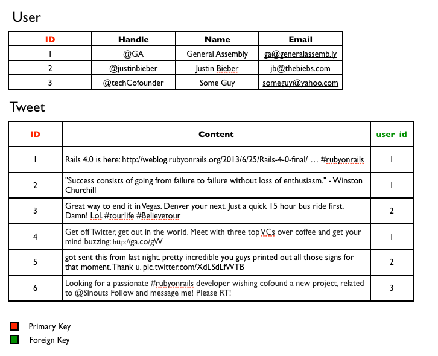
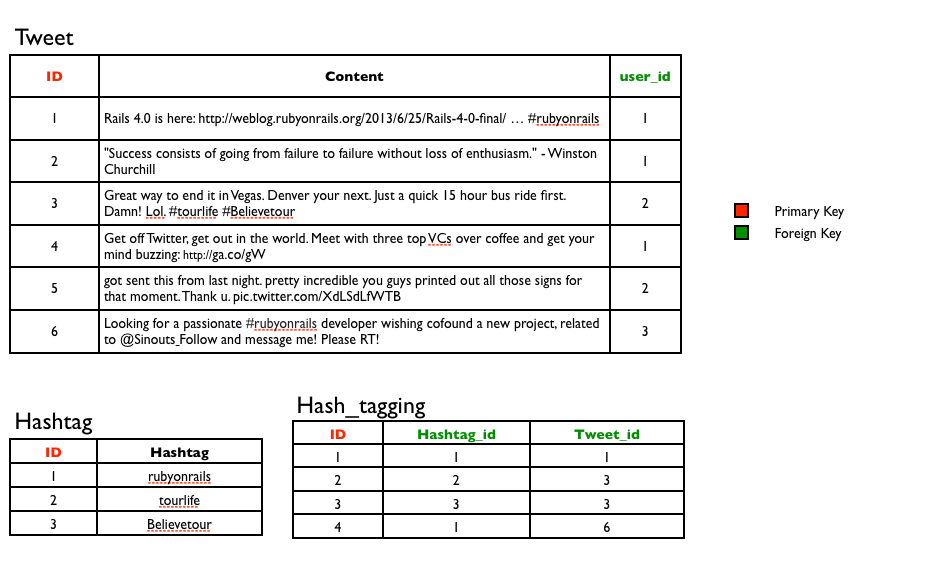

#Notes

---

##Agenda

*	Review: Forms
*	Validation
*	Editing
* 	Controller Actions before/after
* 	Conceptualize Associations

---
Reminders (beginning of class):
Get your resources for class today: (git status, (git commit), git pull upstream master)

Get your rails server running for ShirtsApp in starter code.

---
#Code-Along Continued, Shirts App, Creating and Editing shirts

Last time we started creating new shirts, but our app allows users to create shirts with many missing fields and incorrect data. Let's add validation!

---

###Validation

*	Ensures that we are saving accurate information in the database. 
	*	If our validation fails, don't add record to the database table
	*	If our validation fails let the user know it failed.

Rails has built in methods for ActiveRecord models, ex save. Save will attempt to save the record objects to the database. If it succeeds it will add a new row to the database representing this data. If it fails, it will add error messages to the model (ex shirt.errors). Save checks the data against the validations to determine if it's ok to save the model to the database.

Example validations:

```
  validates :name, :description, :image, presence: true
  validates :description, length: { minimum: 10 }
  validates :image, format: /\A\w+\.png\z/
```

The first one ensures that the values for those properties are not empty.

The second ensures the description is at least 10 characters long.

The last checks that the path for the image is a .png file.

---
### Displaying errors in the view 

ActiveRecord provides the "errors" array on model objects that contains any errors encountered while saving the model:

```
<% if @shirt.errors.any? %>
  <h2>There were errors saving your shirt</h2>
  <ul>
    <% @shirt.errors.full_messages.each do |msg| %>
      <li><%= msg %></li>
    <% end %>
  </ul>
<% end %>
```

---
### Editing Existing Resources

Editing a shirt is a lot like creating a new shirt, except some of the fields might already be populated. Because the functionality is so similar, let's create a partial view to reuse the form!

Create a new partial, ```_form.html.erb``` and populate it with the form for shirts (and error messages, errors can happen when editing or creating!)

---
### Editing in the Controller 

Just like for creating we have two controller actions (```new``` for loading the new page, and ```create``` for when the form is submitted), editing has two controller actions too:

* ```edit``` loads the edit page (when user clicks to edit)
* ```update``` submits the new values for the resource (once user clicks "submit")	

When a user clicks to edit an existing shirt, we need to load the shirt (create a ```@shirt``` object in the controller with the correct info from the database). We've already loaded a shirt when we wrote the ```show``` method, let's reuse that!

(We'll come back to ```update``` in a bit.)

---
### Controller Actions: before/after
Controllers can execute methods before or after calling an action. This is useful if you want to execute a particular shared method before many different actions or if you need to run a particular check before executing the action (ex checking if the user is logged in). Here's an example:

```
before_action :load_shirt, only: [:edit, :show, :update]
```

Here the controller executes "load_shirt" before the "edit", "show" and "update" actions only. This makes sense because we want the controller to load a specific shirt only for these actions.

---

###Updating in the controller

We're already loading the shirt using our contoller action, so now just like with creating a new shirt, here's how to update:

```
    @shirt.update safe_shirt_params #update the shirt to the DB
    redirect_to @shirt #show the new updated shirt
```

---

##Review:

###Forms 
* are used any time you get input from a user
* forms always have two controller actions associated with them: one for loading the form, the second for submitting the form (what are examples of this we've seen so far?)
* two types of forms:
	* ```form_tag``` builds a form like the search bar, not based on a resource/object
	* ```form_for``` created based on properties of an object, usually a model
* Life cycle of a form:
	* First form is loaded (this may require info from the model etc)
	* Next user fills form out and hits "submit"
	* The request comes back to the controller, where it likely directs the model to save some data, then redirects to a new view

###Data safety
* Safe parameters! Remember to specify required and optional parameters if you are expecting a specific format, for instance if you expect a shirt object, require a shirt object and do not allow other properties. (This isn't strictly necessary for things like the search bar, where there is only one parameter and you aren't expecting specific data)
* Model functions ex. "where". Remember to use the SQL string substitution features builtin with ActiveRecord, it helps sanitize the input (YES: "where('table like :q', q: '#{query}' NO: q = 'table like #{query}' // where(q) ")
* Validation on the Model, helps ensure data is in the format you expect:
	```
  	validates :name, :description, :image, presence: true
	```

---

##Associations

* As the data we want to store in each table grows, sometimes we need more than just attributes
* For example, if we want to store the user who wrote a story, we could start by storing the user_name as an attribute on a story
* Then we'd add user_email, user_nickname, etc… and it would quickly get messy

---


##Associations

* Eventually we realize, we actually want to store user data in a _users_ table
* Somehow, we'd need to link each story to its corresponding record in the users table
* This link is known as an _association_

---


##Associations
###Definition

Model associations are how models interact with each other. 

Adding associations will help us know which user posted which story. 

With associations its best to step away from the code and understand conceptually what is happening at a database level.

In the database, two tables can be linked together using a _foreign key_.

---

##Twitter Associations

---

##Associations
### Primary Keys

A unique key (field) that can uniquely identify each row in a table

---

##Associations
### Foreign Keys

Definition: A foreign key is a _column_ that is used to establish and enforce a link between data from two distinct tables.

---


##Associations
###Rails Active Record Associations

__belongs_to__

__has_many__

__has_many :through__

_has_one_

_has_one :through_

_has_and_belongs_to_many_


We will cover the bolded associations.

---

##Associations

User __has_many__ Tweets 

Tweet __belongs_to__ User



---


##Associations

Tweet __has_many__ hash_tags __through__ hash_tagging 





---

##Exercise: Netflix Associations

netflix_associations.md

---


<div id="resources">
## Resources

* Resource on creating/editing models and migrations, including adding validation [Sitepoint](
http://www.sitepoint.com/building-your-first-rails-application-models/)

*	[Implementing users and followers relationship](http://blog.teamtreehouse.com/what-is-a-has_many-through-association-in-ruby-on-rails-treehouse-quick-tip) 

*	[Rails Naming Conventions](http://itsignals.cascadia.com.au/?p=7)

*	What's The Difference Between has_one and belongs_to - [Stack overflow](http://stackoverflow.com/questions/3808926/whats-the-difference-between-belongs-to-and-has-one belongs_to vs has_one)

*	Advanced Rails Forms and nested attributes - [tutorial](http://rubysource.com/complex-rails-forms-with-nested-attributes/)

http://api.rubyonrails.org/classes/ActiveRecord/NestedAttributes/ClassMethods.html


###Still Feel Lost? 
####Catch Up With These Resources

*	[Michael Hartl Chapter 10](http://ruby.railstutorial.org/chapters/user-microposts#top)


*	[Associations Tutorial](http://net.tutsplus.com/tutorials/ruby/active-record-the-rails-database-bridge/) 


*	[Rails Guides - Associations](http://guides.rubyonrails.org/association_basics.html)


*	[Differences in primary and foreign keys](http://www.programmerinterview.com/index.php/database-sql/differences-between-primary-and-foreign-keys/ Primary and Foreign keys)
